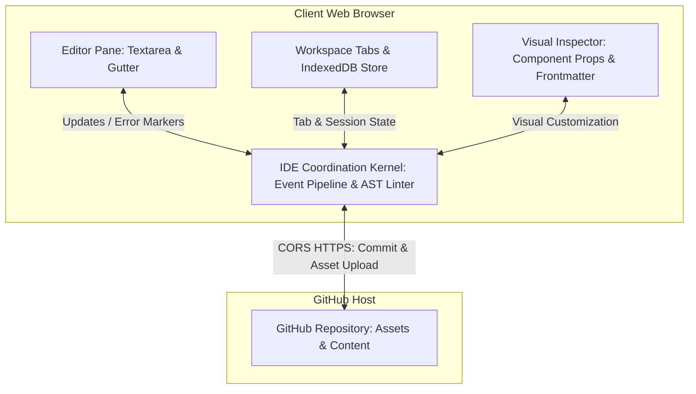
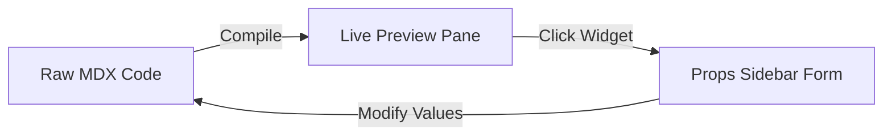

# Authoring IDE Epics - Next.js CMS Workspace

This planning document outlines the technical specification and test-driven development (TDD) blueprint for transforming the Next.js CMS Workspace into a highly interactive, local-first **Authoring IDE**.

---

## 🏗️ Architectural Overview & Dual Diagrams

The Authoring IDE architecture shifts the CMS from a simple markdown split-editor to a full-featured workspace composed of local-first persistence, real-time AST linting, and interactive visual inspecting.

### ASCII System Architecture

```text
+-------------------------------------------------------------------------------------------------+
|                                       Client Web Browser                                        |
|                                                                                                 |
|   +--------------------------+    +--------------------------+    +-------------------------+   |
|   |      Editor Pane         |    |      Workspace Tabs      |    |    Visual Inspector     |   |
|   |  - Textarea Input        |    |  - Tab Context           |    |  - Component Form       |   |
|   |  - Gutter Decorations    |    |  - IndexedDB Persistence |    |  - Frontmatter GUI      |   |
|   +------------+-------------+    +------------+-------------+    +------------+------------+   |
|                |                               |                               |                |
|                v                               v                               v                |
|   +-----------------------------------------------------------------------------------------+   |
|   |                                  IDE Coordination Kernel                                |   |
|   |  - Multi-Tab State Store & Navigation                                                   |   |
|   |  - AST MDX Linter / Parser (Unified/Remark/Rehype)                                      |   |
|   |  - Event Pipeline (Paste / Drag-and-Drop Handler)                                       |   |
|   +--------------------------------------------+--------------------------------------------+   |
|                                                |                                                |
+------------------------------------------------v------------------------------------------------+
                                                 │
                                 CORS HTTPS REST │ GitHub API Operations
                                                 ▼
                                    +--------------------------+
                                    |    GitHub Repository     |
                                    |  - Assets: media uploads |
                                    |  - Content: MDX garden   |
                                    +--------------------------+
```

### Mermaid System Architecture



---

## 🚀 The 5 Authoring IDE Epics

### 1. Asset Pipeline (Image Drag/Drop & Paste Upload) [COMPLETED]
Enables seamless visual writing by converting dropped/pasted local images into permanent GitHub-hosted assets.

*   **TDD Red Criteria (Failure Mode):**
    *   If credentials (Fine-Grained PAT) are missing/invalid or the GitHub API responds with a non-2xx error, the upload must immediately transition to an error/warning state (toast/alert) without altering the user's document text. No empty or broken markdown tags are left in the editor.
    *   If a file is not a supported image format, the paste/drop action is gracefully rejected, notifying the user.
*   **TDD Green Criteria (Success Mode):**
    *   Upon paste/drop of a valid image, intercept the native event, convert the binary file to Base64, and trigger a `PUT /repos/${repo}/contents/public/assets/uploads/${YYYY-MM}/${timestamp}-${filename}` request.
    *   The UI shows a non-blocking upload loader spinner/toast.
    *   On a successful 2xx response, the loader transitions to a success state and inserts the exact markdown tag `` at the cursor position, triggering a clean preview re-render.

---

### 2. Component Inspector (Visual MDX Props Editor) [COMPLETED]
Fuses rich interactive widgets with visual form configurations. Clicking on any component in the MDX preview opens a visual property-inspector card.

```text
+----------------------------------------+
|           Component Inspector          |
|  Widget: <ComplexPlotter />            |
+----------------------------------------+
|  Function: f(z) = [ z^2 - 1           ]|
|  Domain:   X [-2, 2]   Y [-2, 2]       |
|  Grid:     [x] Show Grid Lines         |
+----------------------------------------+
```



*   **TDD Red Criteria (Failure Mode):**
    *   If invalid prop types are supplied through the inspector or the editor text contains syntactically invalid component definitions, the inspector flags the error visually and falls back to standard fields without crashing the page layout.
*   **TDD Green Criteria (Success Mode):**
    *   Selecting a widget block inside the editor text or clicking it in the preview opens a contextual inspector sidebar.
    *   The form dynamically lists all recognized options (sliders, numbers, string fields, booleans).
    *   Modifying an option instantly updates the prop values within the MDX tags in the editor source, triggering a live and synchronized canvas re-render.

---

### 3. Local-First Persistence & Multi-Tabs
Shields content creation from browser crashes or network disruption by utilizing a robust IndexedDB local-first database coupled with an intuitive multi-tab interface.

*   **TDD Red Criteria (Failure Mode):**
    *   In private browsing modes or contexts where IndexedDB is blocked, the persistence kernel gracefully degrades to memory-only or `localStorage` caches while outputting a clean warning, ensuring the workspace remains operational.
*   **TDD Green Criteria (Success Mode):**
    *   The UI features an editing strip allowing multiple files to be opened in discrete tabs.
    *   Each tab maintains its own active text, selection positions, cursor offsets, and history stacks.
    *   Changes to any tab trigger rapid, asynchronous persistence to IndexedDB in the background, making full recovery of all tabs immediate on page refresh.

---

### 4. MDX Linter & IntelliSense
Empowers editors with real-time feedback, highlighting syntax problems and unclosed MDX elements as they write.

*   **TDD Red Criteria (Failure Mode):**
    *   Syntax mistakes (such as unclosed JSX tags or unescaped braces) highlight the exact line and column in the gutter, showing detailed errors in a compiler pane while disabling the broken preview pane.
*   **TDD Green Criteria (Success Mode):**
    *   An AST-based parser evaluates the markdown block inside a debounced 150ms interval.
    *   Syntactically correct files compile smoothly, and any previously registered validation highlights are wiped from the gutter.

---

### 5. Frontmatter GUI
A visual metadata editor that abstracts YAML configuration from authors, parsing and updating markdown frontmatter blocks automatically.

*   **TDD Red Criteria (Failure Mode):**
    *   Invalid YAML syntax in the raw frontmatter block triggers a warning banner, preventing form parsing but protecting the user's raw text from any corrupt mutations or sync overrides.
*   **TDD Green Criteria (Success Mode):**
    *   A collapsible frontmatter form sits above the text input, providing custom fields for:
        *   `title` (string input)
        *   `date` (date picker)
        *   `tags` (pill manager)
        *   `lang` (language toggle)
    *   Editing fields inside the form updates the raw frontmatter block between `---` boundaries at the top of the editor. Modifying the raw text updates the form elements symmetrically in real-time.

---

## 🏗️ Phase 1 Development: Asset Pipeline Task-breakdown
The Asset Pipeline (Epic 1) is scheduled for immediate implementation. It will add native paste/drop behaviors directly inside `src/app/[lang]/workspace/page.tsx`, performing authenticated GitHub API requests and inserting standard markdown assets with zero server dependencies.
