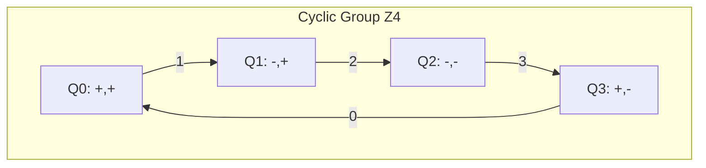
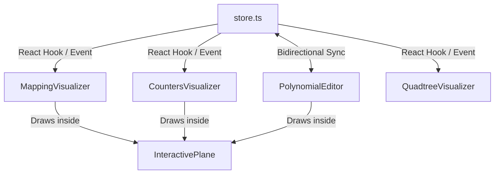

# Documentação Técnica: Visualizações Construtivas do Teorema Fundamental da Álgebra (FTA) sobre Números Racionais

Este documento apresenta a fundamentação matemática, a arquitetura de software e a análise dos artefatos visuais interativos desenvolvidos para demonstrar o Teorema Fundamental da Álgebra utilizando estritamente o corpo dos números complexos racionais, $\mathbb{Q}(i)$.

---

## 1. Fundamentação Matemática Construtiva em $\mathbb{Q}(i)$

Diferente das demonstrações clássicas do FTA, que dependem da completude topológica dos números reais ($\mathbb{R}$) e do plano complexo ($\mathbb{C}$), esta implementação utiliza uma abordagem construtiva baseada em aritmética racional finita, contagem combinatória e desigualdades algébricas em quadratura.

### 1.1 O Corpo dos Números Racionais Complexos

Definimos o plano de busca sobre o corpo dos números complexos com coordenadas racionais:

$$F = \mathbb{Q}(i) = \{a + bi \mid a, b \in \mathbb{Q}\}$$

Como não podemos garantir a existência de raízes quadradas irracionais (que nos levariam para fora de $\mathbb{Q}$), evitamos a norma euclidiana clássica $|z|$. Em seu lugar, adotamos duas métricas estritamente algébricas:

1.  **Quadratura Algébrica ($N$):** Representa a distância quadrática em relação à origem:
    $$N(a + bi) = a^2 + b^2 \in \mathbb{Q}_{\ge 0}$$
2.  **Produto Interno Algébrico ($\langle \cdot, \cdot \rangle$):** Equivalente à parte real do produto pelo conjugado do segundo operando:
    $$\langle w_1, w_2 \rangle = \text{Re}(w_1 \cdot \overline{w_2}) = a_1 a_2 + b_1 b_2 \in \mathbb{Q}$$

Desta forma, a quadratura pode ser expressa como o produto interno auto-referenciado: $N(w) = \langle w, w \rangle$.

### 1.2 Desigualdades e Limitantes em Quadratura

Para suprir a ausência da desigualdade triangular métrica, são deduzidos e aplicados três teoremas fundamentais em $\mathbb{Q}(i)$:

*   **Desigualdade de Cauchy-Schwarz Racional (Teorema 2.1):**
    $$\langle w_1, w_2 \rangle^2 \le N(w_1) N(w_2)$$
    *Prova algébrica:* Baseada na identidade de Lagrange: $N(w_1)N(w_2) - \langle w_1, w_2 \rangle^2 = (a_1 b_2 - b_1 a_2)^2 \ge 0$.
*   **Limitante de Soma em Quadratura (Teorema 2.2):**
    Para $m$ elementos, temos:
    $$N\left(\sum_{k=1}^m w_k\right) \le m \sum_{k=1}^m N(w_k)$$
*   **Limitante Inferior Algébrico (Corolário 2.3):**
    Se a quadratura do termo menor é significativamente menor que a do maior ($N(w_2) \le \frac{1}{9} N(w_1)$), então a quadratura da soma preserva uma fração da magnitude do termo maior:
    $$N(w_1 + w_2) \ge \frac{1}{3} N(w_1)$$

### 1.3 Dominação e Alinhamento do Termo Principal

Decompomos o polinômio $P(z) = c_d z^d + c_{d-1} z^{d-1} + \dots + c_0$ em um termo principal $L(z) = c_d z^d$ e um termo de erro $E(z) = \sum_{k=0}^{d-1} c_k z^k$. 

Ao definir um raio inicial $R \in \mathbb{Q}_{>0}$ por:

$$R^2 = 1 + 9d^2 \sum_{k=0}^{d-1} \frac{N(c_k)}{N(c_d)}$$

Provamos que para todo $z$ na fronteira do quadrado inicial $\partial Q_0$ de lado $2R$:

1.  **Dominância (Teorema 3.1):** A quadratura do erro é estritamente menor que um nono do termo principal: $N(E(z)) < \frac{1}{9} N(L(z))$, garantindo que o polinômio nunca toca a origem na fronteira ($N(P(z)) \ge \mu > 0$).
2.  **Alinhamento (Teorema 3.2):** Os vetores $P(z)$ e $L(z)$ residem no mesmo semiplano algébrico, ou seja, seu produto interno é estritamente positivo:
    $$\langle P(z), L(z) \rangle > 0$$

### 1.4 Número de Rotação Discreto e Rouché Combinatório

O plano complexo sem a origem $F \setminus \{0\}$ é mapeado discretamente em 4 quadrantes pertencentes ao grupo cíclico $\mathbb{Z}_4$:

```text
       Im(z) ↑
             │
       Q1    │    Q0
      (-,+)  │   (+,+)
   ──────────┼──────────→ Re(z)
       Q2    │    Q3
      (-,-)  │   (+,-)
             │
```



Para uma malha fechada de pontos racionais, construímos um contador de quadrante desenrolado $U(j) \in \mathbb{Z}$ que rastreia incrementos e decrementos cíclicos nas transições de pontos adjacentes. O número de rotação discreto é expresso por:

$$\Delta = \frac{U(k) - U(0)}{4}$$

*   **Invariância de Rouché Discreta (Teorema 4.5):** Graças ao alinhamento positivo $\langle P(z), L(z) \rangle > 0$, a diferença entre os contadores desenrolados de $P(z)$ e $L(z)$ nunca pode acumular uma volta completa ($|U_P(j) - U_L(j)| \le 1$). Logo, o índice de rotação de $P(z)$ na fronteira de $Q_0$ é exatamente igual ao grau do polinômio, $\Delta(P) = d$.

### 1.5 Convergência da Bissecção (Quadtree)

O algoritmo de bissecção espacial subdivide recursivamente o quadrado reativo $Q_n$ em 4 sub-quadrados. Por conservação de contorno, a soma das rotações internas equivale à rotação do quadrado pai:

$$\sum_{i=1}^4 \Delta(Q_{n,i}) = \Delta(Q_n)$$

Como $\Delta(Q_n) = d \neq 0$, pelo menos um sub-quadrado possui rotação não nula. Seguindo a regra de seleção determinística (Axioma 5.1), escolhemos o primeiro sub-quadrado com $\Delta \neq 0$ como o novo $Q_{n+1}$.

Provamos que:
1.  **A sequência de centros $(z_n)$ é de Cauchy:** Como o tamanho do lado diminui pela metade em cada passo ($L_n = 2R/2^n$), a distância quadrática entre quaisquer termos futuros é limitada por $N(z_n - z_m) \le \frac{8R^2}{4^n}$, que tende a zero.
2.  **Avaliação converge a zero (Teorema 6.2):** Pelo limitante de Lipschitz algébrico $N(P(u) - P(v)) \le K \cdot N(u - v)$, se a quadratura de $P(z)$ não convergisse a zero, a variação do polinômio em níveis profundos seria insuficiente para circular a origem, forçando $\Delta = 0$ (uma contradição direta). Portanto, $\lim_{n \to \infty} N(P(z_n)) = 0$.

---

## 2. Arquitetura de Software do Módulo FTA

Os componentes visuais interativos residem no diretório `src/components/fta` e dependem de um modelo de fluxo de dados unidirecional/unificado altamente coeso.

### 2.1 Armazenamento Central de Estado (`store.ts`)

O estado reativo do polinômio é orquestrado por um custom store reativo que gerencia coeficientes e raízes em tempo real sem dependências externas pesadas.

#### Recursos e Algoritmos do Store:
1.  **Deteção de Raízes Simultânea (Durand-Kerner):** 
    Para converter coeficientes para raízes ($C \to R$), o algoritmo Weierstrass-Durand-Kerner é executado de forma iterativa no plano complexo:
    $$z_i^{(k+1)} = z_i^{(k)} - \frac{P(z_i^{(k)})}{\prod_{j \neq i} (z_i^{(k)} - z_j^{(k)})}$$
2.  **Expansão Simétrica de Coeficientes (Vieté):**
    Para propagar mudanças de raízes de volta aos coeficientes ($R \to C$), as fórmulas de Viète expandem as raízes algebricamente com alta precisão.
3.  **Aproximação de Frações Contínuas:**
    Para manter a consistência com a teoria matemática de números racionais, o store expõe o método `approximateDecimal` que aproxima valores reais por números racionais $p/q$ limitados a uma profundidade parametrizável $n$.

### 2.2 Diagrama de Fluxo de Dados e Componentes

```text
                          ┌──────────────────────────┐
                          │     Zustand Store        │
                          │   - coefficients[]       │
                          │   - roots[]              │
                          └─────────────┬────────────┘
                                        │
           ┌────────────────────────────┼───────────────────────────┐
           ▼                            ▼                           ▼
┌───────────────────────┐    ┌─────────────────────┐    ┌───────────────────────┐
│   PolynomialEditor    │    │  MappingVisualizer  │    │  CountersVisualizer   │
│ - Edição Math Serif   │    │ - Mapeamento Q0     │    │ - Contadores U(j)     │
│ - Frações Contínuas   │    │ - Cores de Fase     │    │ - Degraus de Rouché   │
└───────────────────────┘    └─────────────────────┘    └───────────────────────┘
```



---

## 3. Análise dos Artefatos Visuais Existentes

### 3.1 `InteractivePlane.tsx` (Motor de Viewport)
Um container SVG de câmera infinita 2D projetado especificamente para gráficos matemáticos.
*   **Gestão de Viewport:** Controla estados reativos de `viewBox` (x, y, largura, altura) suportando transformações automáticas baseadas em caixas delimitadoras (`dataBounds`).
*   **Interações de Usuário:** Suporta arrastar para mover (panning), pinçar e interações de mouse de roda livre de forma não passiva para prevenir o scroll de página global.
*   **Isomorfismo Matemático:** Fornece as funções utilitárias `screenToMath` e `mathToScreen` que sincronizam perfeitamente coordenadas de pixel da tela com os eixos cartesianos reais complexos.

### 3.2 `PolynomialEditor.tsx` (Editor de Precisão Racional)
Permite a visualização em formato math-serif do polinômio, integrado com controles deslizantes de profundidade de frações contínuas.
*   **Invariante de Arredondamento:** Exibe coeficientes no formato $p/q$ racional exato. Quando o usuário arrasta os controles de profundidade, a precisão do arredondamento é alterada dinamicamente, permitindo ver a transição física entre coeficientes decimais aproximados e suas frações geratrizes estritas.

### 3.3 `MappingVisualizer.tsx` (Visualizador de Domínio para Imagem)
Ilustra a transformação conforme mapeando o contorno quadrado externo $Q_0$ do plano de domínio $z$ para o plano de imagem $P(z)$.
*   **Sincronização de Fase de Cores:** Cada ponto no contorno do domínio recebe uma cor HSL mapeada em espectro contínuo de arco-íris $[0, 2\pi]$ com base em seu ângulo de fase. No plano de imagem, os pontos correspondentes retêm suas cores originais, permitindo ao leitor rastrear de forma intuitiva como o contorno contínuo de domínio se expande e se dobra ao redor da origem.

### 3.4 `CountersVisualizer.tsx` (Contador Desenrolado de Degraus)
Demonstra de forma dinâmica e interativa a prova do Teorema de Rouché Discreto.
*   **Gráfico de Escada Dinâmico:** Plota os contadores unrolled de quadrantes $U_L(j)$ e $U_P(j)$ lado a lado no plano temporal conforme um cursor varre a malha de contorno.
*   **Visualização de Divergência:** Destaca de forma dinâmica que a diferença vertical entre o termo principal $L(z)$ e o polinômio completo $P(z)$ nunca excede 1 unidade de degrau, oferecendo evidência visual instantânea de que as curvas são homotopicamente equivalentes na ausência de cruzamentos com a origem.

### 3.5 `QuadtreeVisualizer.tsx` (Radar de Bissecção Espacial)
Executa a busca localizadora de raízes dividindo o plano de domínio em sub-quadrados e calculando seus respectivos índices de rotação em tempo real.
*   **Rastreamento com Radar:** Um seeker animado varre os perímetros avaliados nas imagens em sincronia com um feixe radial projetado a partir da origem $(0,0)$.
*   **Cálculo Dinâmico de Rotação:** Computa a variação do ângulo acumulado e exibe o número de rotação discreto ($\Delta = 0$ ou $\Delta \ge 1$) para cada sub-quadrado.
*   **Transição de Câmera Suave:** Ao alcançar o veredicto de cada passo, os eixos de câmera do domínio sofrem uma interpolação cúbica (zoom suave) em direção ao sub-quadrado vencedor, reiniciando o ciclo de bisseção no novo nível de profundidade.

---

## 4. Próxima Etapa: O Componente `<QuadtreeProofViewer />`

O novo componente `<QuadtreeProofViewer />` servirá como a peça central de síntese no MDX. Ele integrará o editor interativo de LaTeX (via MathLive), a coloração de domínio de alto desempenho em Canvas 2D, e uma máquina de estados robusta (Idle, Bisecting, Tracing, Verdict) capaz de avançar e retroceder no histórico de subdivisões espaciais, fornecendo ao leitor o controle absoluto da prova geométrica do teorema.
