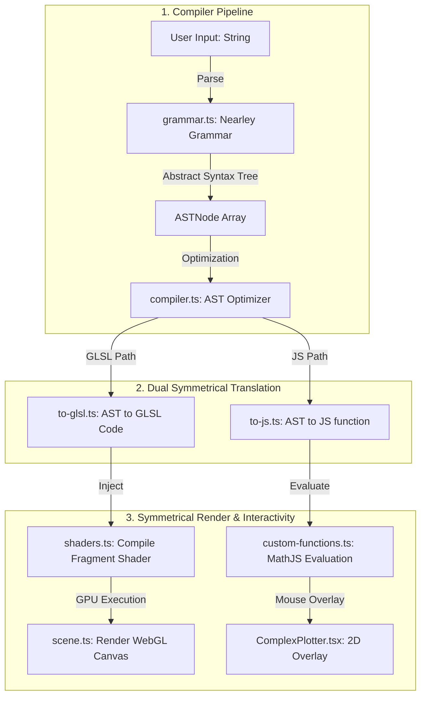

# Complex Function WebGL Plotter Core

A high-performance, strongly typed, mathematically exact WebGL domain-coloring plotter compiled dynamically from raw mathematical strings.

## Architectural Overview

This component implements a compiler pipeline that translates human-readable mathematical strings (e.g., `z^2 + c` or `sin(z)`) into low-level, hardware-accelerated fragment shaders (GLSL) executed in parallel on the GPU at 60 FPS. Simultaneously, it compiles the same mathematical expression into a JavaScript-evaluatable function for client-side tooltips and numerical contour integration.

### Symmetrical Pipeline Diagram

```text
               [ User Input Expression String ]
                              │
                              ▼
                       [ grammar.ne ]
                (Parser: Earley Nearley Grammar)
                              │
                              ▼
                     [ AST (ASTNode) ]
    ['add', ['pow', ['variable', 'z'], 2], ['variable', 'c']]
                              │
                              ▼
                      [ compiler.ts ]
            (Optimizer & Algebraic Simplifier)
                              │
               ┌──────────────┴──────────────┐
               ▼                             ▼
        [ to-glsl.ts ]                 [ to-js.ts ]
       (Compiler -> GLSL)            (Compiler -> JS)
               │                             │
               ▼                             ▼
         [ shaders.ts ]             [ custom-functions.ts ]
    (Fragment Shader Template)       (Symmetrical MathJS)
               │                             │
               ▼                             ▼
         [ WebGL GPU ]               [ Canvas 2D Overlay ]
    (60fps Domain Coloring)         (Axes & Mouse Tooltips)
```



---

## File System & Component Responsibilities

### 1. Interactivity Layer
*   `ComplexPlotter.tsx`: Client-only React wrapper managing interactive state, reactive uniform inputs, `ResizeObserver` viewport tracking, drag-to-pan, and non-passive wheel-to-zoom controls.

### 2. Compilation & Grammar
*   `types.ts`: Strictly defines mathematical core contracts, including recursively nested `ASTNode` structures and extended `WebGLRenderingContextExtended` environments.
*   `gl-code/grammar.ts` (compiled from `grammar.ne`): Earley parser grammar defining algebraic syntax, parentheses precedence, modular elliptic functions, and custom constants ($\pi, \tau, \phi$).
*   `gl-code/complex-functions.ts`: Catalogs all active complex-analytic functions (such as Weierstrass elliptic $\wp(z, \tau)$, Dixon modular, Gamma $\Gamma(z)$, Lambert $W$, and Riemann Zeta $\zeta(z)$), mapping their GPU-uniform parameters and dependency trees.

### 3. Optimization & Translation
*   `gl-code/translators/compiler.ts`: Recursively optimizes the AST. Evaluates pure constant expressions, reduces operations (like multiplying by 1 or adding 0), and expands sums and products.
*   `gl-code/translators/derivative.ts`: Analytically evaluates derivatives using algebraic rules with automatic finite-difference numerical fallback for non-differentiable constructs.
*   `gl-code/translators/to-glsl.ts`: Compiles the AST into Low-Level GLSL. Maps coordinates and converts numbers into `vec2` or `vec3` (log-magnitude) representations.
*   `gl-code/translators/to-js.ts`: Translates the AST into native JavaScript closures executing on-the-fly, backed by `mathjs` within `custom-functions.ts` for pixel-to-plot tooltip calculations.

### 4. GPU Pipeline
*   `gl-code/shaders.ts`: Compiles WebGL shaders. Injects mathematical dependency trees and applies domain coloring, anti-aliased checkerboard grids, and color-inversion for dark-mode.
*   `gl-code/scene.ts`: Manages WebGL context state, vertex buffer geometry, dynamic viewport sizing, and draws coordinate axes onto a 2D canvas overlay.

---

## Mathematical Rendering Principles

### 1. Domain Coloring
A number $w = f(z) = u + iv$ is visualized in polar coordinates:
*   **Phase Angle ($\theta = \text{arg}(w)$)** maps directly to the **Hue** parameter in the HSL color wheel.
*   **Magnitude ($r = |w|$)** maps periodically to the **Value/Lightness** in a saw-tooth logarithmic scale:
    $$\text{Periodicity} \propto \text{fract}(\log_2(r))$$
    This periodic shading draws sharp curves of constant magnitude, exposing zeros (basins of black color convergence) and poles (glowing points of infinite white expansion).

### 2. Anti-Aliasing and Anti-Moiré
To prevent spatial frequencies from aliasing near infinity, the shader executes **4-Rook Supersampling**:
```text
      Pixel Area
    ┌───────────┐
    │     A     │  A = (+0.125, +0.375)
    │  D     B  │  B = (+0.375, -0.125)
    │     C     │  C = (-0.125, -0.375)
    └───────────┘  D = (-0.375, +0.125)
```
The shader evaluates the function at four rotated offsets inside the pixel, calculating a dynamic spatial derivative. If the phase derivative is too high, it smoothly dampens the grids, avoiding Moiré pattern artifacts.
