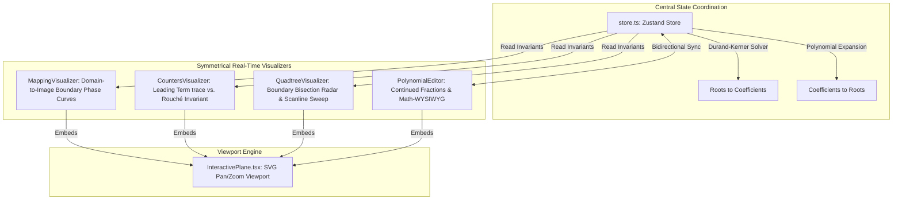

# Fundamental Theorem of Algebra (FTA) Visualizers Core

An interactive, multi-dimensional, real-time math simulation validating the Fundamental Theorem of Algebra using continuous fraction editors, winding-number tracking, and active quadtree bisection radars.

## Architectural Overview

This module uses a highly cohesive, reactive, central observable store (`store.ts`) that coordinates states between five independent visualizers. It synchronizes polynomial coefficients and complex roots bi-directionally in real-time, enforcing mathematical invariants across different geometric spaces.

### Shared-State Coordination Diagram

```text
                  ┌───────────────────────────────┐
                  │    Polynomial Store (Zustand) │
                  │  - Roots Array                │
                  │  - Coefficients Array         │
                  └───────────────┬───────────────┘
                                  │
         ┌────────────────────────┼────────────────────────┐
         ▼                        ▼                        ▼
┌──────────────────┐    ┌──────────────────┐    ┌──────────────────┐
│ PolynomialEditor │    │MappingVisualizer │    │QuadtreeVisualizer│
│ - Math WYSIWYG   │    │ - Boundary Phase │    │ - Root search    │
│ - Continued Frac │    │ - Perimeter map  │    │ - Bisection sweep│
└──────────────────┘    └──────────────────┘    └──────────────────┘
```



---

## File System & Component Responsibilities

### 1. Centralized Coordination
*   `store.ts`: Implements the central State Store using Zustand/observable primitives. Coordinates roots $\leftrightarrow$ coefficients bi-directionally in real-time.
    *   **Roots-to-Coefficients ($R \to C$):** Computes polynomial coefficients algebraically via exact symmetrical sum-product expansions (Viete's Formulas) to avoid numerical drift.
    *   **Coefficients-to-Roots ($C \to R$):** Employs the **Weierstrass-Durand-Kerner** algorithm (a simultaneous root-finding algorithm with a quadratic rate of convergence) to find roots numerically:
        $$z_i^{(k+1)} = z_i^{(k)} - \frac{P(z_i^{(k)})}{\prod_{j \neq i} (z_i^{(k)} - z_j^{(k)})}$$

### 2. Symmetrical Sub-Visualizers
*   `InteractivePlane.tsx`: A reusable camera-viewport wrapper built on native SVG. Provides automated screen-bounds centering, focal zoom-in/out, drag-to-pan, and non-passive wheel events to suppress background page-scroll.
*   `PolynomialEditor.tsx`: Math-serif dual editor displaying vertical fraction formulas. Provides slider controls to adjust fraction snapping depths calculated via **Continued Fractions** up to level $n$.
*   `MappingVisualizer.tsx`: Plots strictly the boundary of $Q_0 \to P(Q_0)$ using a continuous rainbow phase-angle gradient progression ($[0, 2\pi]$) to illustrate visual conformal mapping and loop expansion.
*   `CountersVisualizer.tsx`: Tracks step-by-step winding loops. Plots boundary traces of the leading monomial ($z^n$) and the complete polynomial ($P(z)$), validating the Rouché trace invariant $|P(z) - z^n| \le 1$.
*   `QuadtreeVisualizer.tsx`: Runs a 2D boundary-bisection search. Features an 800-point perimeter winding-number radar simulation, real-time scanline sweeps, cubic-easing zoom-to-root, and dynamic bounding-box localization.

---

## 🛠️ Como Adicionar Novas Contribuições (Guia de Extensão)

Se você deseja expandir o ecossistema do **Teorema Fundamental da Álgebra (FTA)** criando novos visualizadores ou ferramentas interativas, siga a arquitetura de estado centralizado existente. O design foi concebido para ser altamente modular e "Plug-and-Play".

### Passo 1: Criando o Componente Visualizador
Crie um novo arquivo `.tsx` (ex: `NovoVisualizador.tsx`) dentro de `src/components/fta/`. Este componente não deve guardar o estado do polinômio de forma isolada (evite `useState` para raízes ou coeficientes). Ele deve ser um "ouvinte" ou "despachante" do repositório central.

```tsx
"use client";
import React from 'react';
import { usePolynomial, Complex } from './store';
import InteractivePlane from './InteractivePlane';

export default function NovoVisualizador() {
  // 1. Conecte-se ao estado global bidirecional
  const roots = usePolynomial((state) => state.roots);
  const coefficients = usePolynomial((state) => state.coefficients);
  const setRoot = usePolynomial((state) => state.setRoot);

  // 2. Utilize o InteractivePlane como viewport para garantir zoom/pan simétrico
  return (
    <div className="relative aspect-square border border-zinc-800 bg-black rounded-xl overflow-hidden">
      <InteractivePlane>
        {/* Renderize sua matemática baseada nas raízes globais */}
        {roots.map((r, i) => (
          <circle key={i} cx={r.re} cy={-r.im} r={0.1} fill="emerald" />
        ))}
      </InteractivePlane>
    </div>
  );
}
```

### Passo 2: Integrando com a Máquina de Estado (`store.ts`)
Se o seu visualizador precisa de uma nova métrica de estado que afeta todo o ecossistema (por exemplo, "número de iterações do algoritmo"), você deve injetar isso no `store.ts`:
1. Abra `src/components/fta/store.ts`.
2. Adicione a propriedade na interface `PolynomialState`.
3. Defina o valor inicial e o método `set` correspondente na função `create`.

**⚠️ Importante:** Nunca modifique coeficientes e raízes independentemente no seu componente! Se você precisar mover uma raiz, chame o método `setRoot(index, newComplex)`. O Zustand interceptará essa chamada e **automaticamente engatilhará** o algoritmo de expansão de polinômios (Viete) para atualizar os coeficientes em tempo real para os outros visualizadores.

### Passo 3: Injetando na Página de Ensaios (MDX)
Para que o seu novo componente seja exibido no artigo teórico, basta importá-lo no arquivo Markdown!
Os ensaios estão localizados em `src/content/essays/fta/`.

1. Abra `en.mdx` (e `pt.mdx` para a versão em português).
2. No topo do arquivo, importe seu componente React:
   ```mdx
   import NovoVisualizador from "../../../components/fta/NovoVisualizador";
   ```
3. Chame-o declarativamente em qualquer parte do texto:
   ```mdx
   Como podemos observar na simulação abaixo:
   
   <NovoVisualizador />
   ```

### 🚨 Regras de Ouro (Invariantes de Engenharia)
* **Zero Hydration Mismatch:** Como o MDX é pré-renderizado estaticamente pelo Next.js (SSG), assegure-se de que nenhum valor aleatório ou cálculo pesado dependente do tamanho da tela (`window.innerWidth`) seja executado na raiz da renderização inicial. Use hooks como `useEffect` para deferir cálculos pesados exclusivos de *Client-Side*.
* **Sem Loops Infinitos:** Limite fisicamente qualquer laço computacional (`for`, `while`). Por exemplo, a simulação geométrica do `QuadtreeVisualizer` restringe fisicamente a bisseção de busca a `maxDepth = 7`.
* **Mapeamento de Coordenadas SVG:** O componente `InteractivePlane` trabalha em espaço complexo natural. O eixo Imaginário (+Y) cresce para cima, e o plano de visão padrão foca de -2 a +2. Não subtraia o `y` de `height` manualmente; o `InteractivePlane` já aplica a matriz de inversão transformacional via CSS/SVG!
