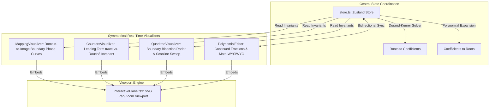

# Fundamental Theorem of Algebra (FTA) Visualizers Core

An interactive, multi-dimensional, real-time math simulation validating the Fundamental Theorem of Algebra using continuous fraction editors, winding-number tracking, and active quadtree bisection radars.

## Architectural Overview

This module uses a highly cohesive, reactive, central observable store (`store.ts`) that coordinates states between five independent visualizers. It synchronizes polynomial coefficients and complex roots bi-directionally in real-time, enforcing mathematical invariants across different geometric spaces.

### Shared-State Coordination Diagram

```text
                  ┌───────────────────────────────┐
                  │    Polynomial Store (Zustand) │
                  │  - Roots Array                │
                  │  - Coefficients Array         │
                  └───────────────┬───────────────┘
                                  │
         ┌────────────────────────┼────────────────────────┐
         ▼                        ▼                        ▼
┌──────────────────┐    ┌──────────────────┐    ┌──────────────────┐
│ PolynomialEditor │    │MappingVisualizer │    │QuadtreeVisualizer│
│ - Math WYSIWYG   │    │ - Boundary Phase │    │ - Root search    │
│ - Continued Frac │    │ - Perimeter map  │    │ - Bisection sweep│
└──────────────────┘    └──────────────────┘    └──────────────────┘
```



---

## File System & Component Responsibilities

### 1. Centralized Coordination
*   `store.ts`: Implements the central State Store using Zustand/observable primitives. Coordinates roots $\leftrightarrow$ coefficients bi-directionally in real-time.
    *   **Roots-to-Coefficients ($R \to C$):** Computes polynomial coefficients algebraically via exact symmetrical sum-product expansions (Viete's Formulas) to avoid numerical drift.
    *   **Coefficients-to-Roots ($C \to R$):** Employs the **Weierstrass-Durand-Kerner** algorithm (a simultaneous root-finding algorithm with a quadratic rate of convergence) to find roots numerically:
        $$z_i^{(k+1)} = z_i^{(k)} - \frac{P(z_i^{(k)})}{\prod_{j \neq i} (z_i^{(k)} - z_j^{(k)})}$$

### 2. Symmetrical Sub-Visualizers
*   `InteractivePlane.tsx`: A reusable camera-viewport wrapper built on native SVG. Provides automated screen-bounds centering, focal zoom-in/out, drag-to-pan, and non-passive wheel events to suppress background page-scroll.
*   `PolynomialEditor.tsx`: Math-serif dual editor displaying vertical fraction formulas. Provides slider controls to adjust fraction snapping depths calculated via **Continued Fractions** up to level $n$.
*   `MappingVisualizer.tsx`: Plots strictly the boundary of $Q_0 \to P(Q_0)$ using a continuous rainbow phase-angle gradient progression ($[0, 2\pi]$) to illustrate visual conformal mapping and loop expansion.
*   `CountersVisualizer.tsx`: Tracks step-by-step winding loops. Plots boundary traces of the leading monomial ($z^n$) and the complete polynomial ($P(z)$), validating the Rouché trace invariant $|P(z) - z^n| \le 1$.
*   `QuadtreeVisualizer.tsx`: Runs a 2D boundary-bisection search. Features an 800-point perimeter winding-number radar simulation, real-time scanline sweeps, cubic-easing zoom-to-root, and dynamic bounding-box localization.
