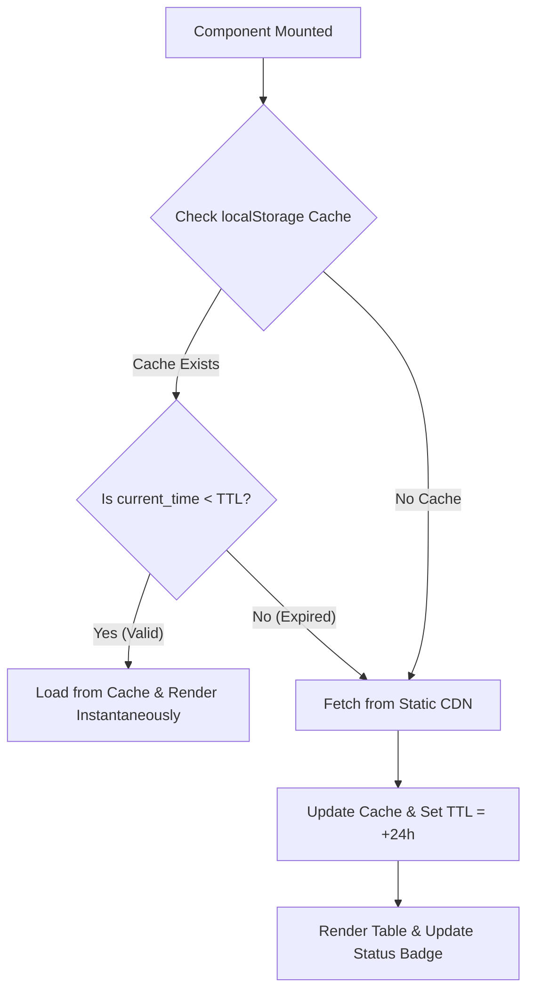

# B3 Screener: Zero-Infrastructure Architecture

Modern financial dashboards are often bogged down by heavy, expensive server-side stacks, redundant database queries, and CORS blocking issues. The **B3 Screener** demonstrating above is designed with a **Zero-Infrastructure Philosophy**, offloading heavy analytical calculations and caching entirely to the client's browser.

By treating the browser as an active edge-computing node, we achieve instantaneous responsiveness (microseconds), bulletproof resilience, and zero cloud hosting costs.

---

## 1. Storage & Pipeline: Git-Backed Static JSON

Traditional platforms query a relational database on every page request to fetch daily-closing stock indicators. Since B3 stock indicators change at most once a day after the market closes, this active database query pattern is extremely wasteful.

Our architecture leverages a decoupled static-data pipeline:

1. **Scheduled Scraping:** A daily cron job (executed via lightweight GitHub Actions or local runners) fetches raw financial data from public APIs.
2. **Aggressive Aggregation:** The script filters, cleans, and pre-compiles all financial ratios (P/E, ROE, Net Margin, Debt/EBITDA) into a single, compact `indicators.json` file.
3. **CDN Distribution:** The JSON artifact is committed directly to a Git branch or a public CDN. Because GitHub Pages automatically serves files with `Access-Control-Allow-Origin: *` headers, we bypass CORS restrictions entirely without needing an intermediate API proxy.

---

## 2. Client-Side Caching: LocalStorage with 24h TTL

Fetching the complete stock list on every view transition or page refresh degrades the user experience and wastes API bandwidth. We resolve this by implementing an automatic, lightweight cache-manager in `localStorage` with a 24-hour **Time-To-Live (TTL)**.

When the component mounts, the execution flow is as follows:



This simple caching wrapper reduces server load to **one single request per user per day**, ensuring the dashboard remains completely responsive.

---

## 3. Edge Computing: Sorting and Filtering in the Browser

Rather than pagination and sorting on a remote SQL database, the B3 Screener loads the entire pre-compiled market dataset into the browser's memory.

For a dataset of B3's size (around 400 highly liquid companies), modern Javascript JIT compilers sort and filter arrays instantly. Sorting an array of 500 objects takes less than **1 millisecond** in typical JS engines, yielding a far smoother user experience than traditional server-side rendering.

### Financial Overrides: The Negative P/E Edge Case

Standard numeric sorting algorithms are blind to financial realities. The **Price-to-Earnings (P/E)** ratio represents how many years of current net income it takes to pay back the stock price:

$$
\text{P/E} = \frac{\text{Price}}{\text{Earnings Per Share (EPS)}}
$$

When a company operates at a net loss, its earnings are negative, which mathematically results in a **negative P/E ratio**.

If we apply a standard ascending sorting algorithm to the P/E column:
* **Expected Mathematical Output:** Negative values appear at the very top (e.g., $-12.5$, $-4.2$, $3.5$, $8.1$, $32.5$).
* **Real-World Financial Logic:** Companies operating in loss are highly risky and of worst value. They should appear at the **bottom** of the list when sorting by P/E from cheapest to dearest, not the top.

To fix this amadorian sorting bug, we override the default numeric sort. We define a modified P/E value, $\tilde{PE}_i$, for comparison when sorting in ascending order:

$$
\tilde{PE}_i = \begin{cases} PE_i & \text{if } PE_i \ge 0 \\ +\infty & \text{if } PE_i < 0 \end{cases}
$$

By treating negative P/E values as positive infinity ($+\infty$), we programmatically force companies with net losses to the bottom of the table, restoring professional financial convention:

```typescript
// Custom sorting logic for B3 Screener
if (sortKey === "pl" && sortDirection === "asc") {
  if (valueA < 0) valueA = 99999; // Treat as +Infinity
  if (valueB < 0) valueB = 99999;
}
```

---

## 4. Well-Architected Cost Optimization

The entire cost footprint of this architecture scales with elegant simplicity:

| Component | Traditional Stack | Zero-Infra Architecture | Cost |
| :--- | :--- | :--- | :--- |
| **Compute** | NodeJS/Go Backend on AWS ECS | Web Browser (Client-Side) | **$0.00** |
| **Database** | Amazon RDS PostgreSQL | Static Git-backed JSON | **$0.00** |
| **API Proxy** | Nginx with CORS configuration | GitHub Pages Native CDN | **$0.00** |
| **Monitoring** | Datadog/CloudWatch | Client-side console & telemetry | **$0.00** |

By transferring the execution burden from our servers to the client's idle CPU, we achieve infinite scalability and maximum speed with a flat operational cost of exactly **$0.00 per month**.
