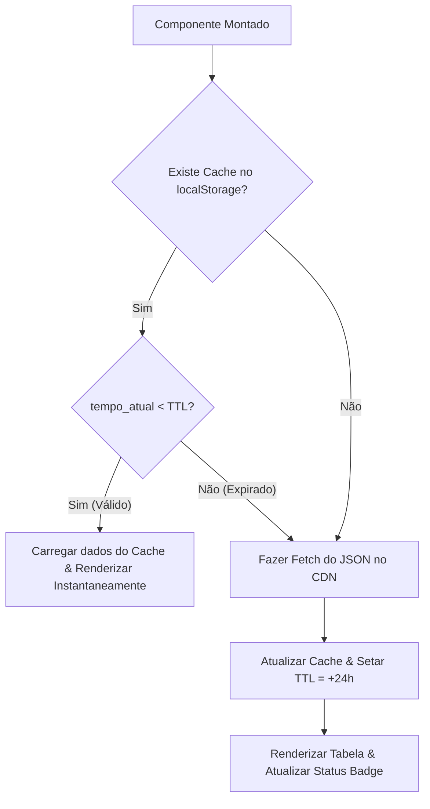

# Screener B3: Arquitetura Zero Infraestrutura

Os painéis financeiros modernos são frequentemente sobrecarregados por pilhas complexas de servidores, consultas redundantes a bancos de dados e problemas de bloqueio de CORS de APIs externas. O **Screener B3** demonstrado acima foi projetado sob uma **Filosofia de Zero Infraestrutura (Zero-Infra)**, deslocando o processamento analítico pesado e o armazenamento em cache diretamente para o navegador do leitor.

Ao tratar o navegador do cliente como um nó de processamento ativo (edge-computing), alcançamos carregamento instantâneo, resiliência impecável e custo zero de hospedagem em nuvem.

---

## 1. Pipeline de Dados: JSON Estático via Git

Plataformas tradicionais consultam um banco de dados relacional a cada requisição de página para buscar os indicadores diários de fechamento das ações. Como os indicadores fundamentalistas da B3 mudam, no máximo, uma vez ao dia após o fechamento do pregão, esse padrão de consulta dinâmica é extremamente ineficiente.

Nossa arquitetura utiliza uma abordagem estática desacoplada:

1. **Scraping Agendado:** Uma tarefa agendada diária (cron job executado via GitHub Actions) busca dados financeiros brutos de APIs públicas.
2. **Agregação Agressiva:** O script filtra, limpa e pré-compila os indicadores de cada ação (P/L, ROE, Margem Líquida, Dívida/EBITDA) em um único arquivo compactado `indicators.json`.
3. **Distribuição via CDN:** O artefato JSON é enviado diretamente para a branch de publicação do GitHub Pages. Como o GitHub Pages serve arquivos estáticos com cabeçalhos `Access-Control-Allow-Origin: *` de forma nativa, contornamos problemas de CORS sem precisar de um servidor proxy intermediário.

---

## 2. Cache no Cliente: LocalStorage com TTL de 24h

Fazer o download da listagem completa de ativos a cada transição de página ou atualização consome banda desnecessária e desgasta a cota de requisições do usuário. Para resolver isso, implementamos um gerenciador de cache transparente no `localStorage` do navegador com um tempo de vida útil de 24 horas (**Time-to-Live ou TTL**).

Quando o componente é carregado, o fluxo de execução funciona da seguinte forma:



Essa simples camada de cache reduz a carga de rede a **apenas uma única requisição por usuário ao dia**, tornando o painel extremamente rápido.

---

## 3. Edge Computing: Ordenação e Filtragem no Navegador

Em vez de fazer paginação e ordenação no servidor com queries SQL tradicionais, o Screener B3 carrega o conjunto completo de dados pré-compilados do mercado na memória do navegador.

Para um conjunto do tamanho da B3 (cerca de 400 empresas com liquidez diária), os compiladores JIT modernos do JavaScript realizam filtragem e ordenação instantaneamente. Ordenar uma array de 500 objetos leva menos de **1 milissegundo** nos navegadores atuais, oferecendo uma experiência de uso infinitamente mais suave do que a tradicional renderização no servidor.

### Correções Financeiras: O Caso de Uso do P/L Negativo

Os algoritmos triviais de ordenação numérica são cegos às regras de negócios do mercado financeiro. O índice **Preço sobre Lucro (P/L)** representa a quantidade de anos de lucro que o investidor demoraria para reaver o capital investidor na empresa:

$$
\text{P/L} = \frac{\text{Preço da Ação}}{\text{Lucro por Ação (LPA)}}
$$

Se uma empresa está operando com prejuízo líquido, seu lucro é negativo, o que resulta matematicamente em um **P/L negativo**.

Ao ordenar a coluna de P/L em ordem crescente (do menor para o maior):
* **Resultado Matemático Padrão:** Os valores negativos aparecem no topo da tabela (ex: $-12.5$, $-4.2$, $3.5$, $5.9$, $32.5$).
* **Lógica Financeira Real:** Empresas com prejuízo estão em situação de estresse ou alto risco, representando teoricamente o "pior" valor relativo de triagem inicial. Elas devem obrigatoriamente ir para o **fim da fila** quando ordenamos por menor P/L (do mais barato para o mais caro).

Para alinhar a tabela com a lógica real de mercado, sobrescrevemos o algoritmo de ordenação para P/L. Criamos um valor modificado, $\tilde{PL}_i$, para a comparação de classificação:

$$
\tilde{PL}_i = \begin{cases} PL_i & \text{if } PL_i \ge 0 \\ +\infty & \text{if } PL_i < 0 \end{cases}
$$

Ao forçar os valores negativos para o infinito positivo ($+\infty$), garantimos que as empresas em prejuízo fiquem sempre na parte inferior da listagem:

```typescript
// Lógica de negócio financeira no componente React
if (sortKey === "pl" && sortDirection === "asc") {
  if (valueA < 0) valueA = 99999; // Força prejuízo para o fim
  if (valueB < 0) valueB = 99999;
}
```

---

## 4. Análise de Custos Otimizada

A pegada de custos operacionais dessa arquitetura escala com impressionante simplicidade:

| Componente | Infraestrutura Tradicional | Arquitetura Zero-Infra | Custo |
| :--- | :--- | :--- | :--- |
| **Servidores** | Backend NodeJS/Go no AWS ECS | Navegador do Cliente (Client-Side) | **$0.00** |
| **Banco de Dados** | Amazon RDS PostgreSQL | JSON estático com backup no Git | **$0.00** |
| **API Proxy** | Nginx com configuração CORS | CDN nativo do GitHub Pages | **$0.00** |
| **Monitoramento** | Datadog ou AWS CloudWatch | Console do navegador & telemetria | **$0.00** |

Ao transferir todo o custo computacional e de busca de registros para os navegadores dos próprios usuários, alcançamos escalabilidade infinita, carregamento em microssegundos e custo fixo operacional estável de **$0.00 ao mês**.
