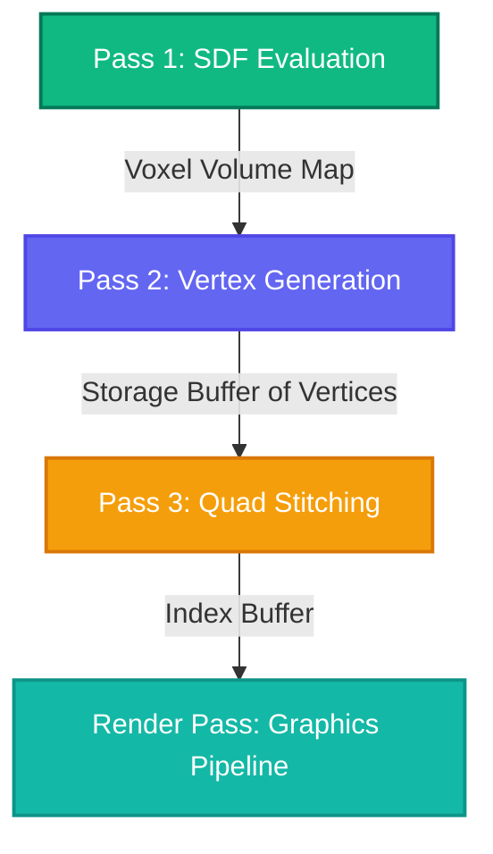

# NodeGraft: Procedural 3D WebGPU Engine

NodeGraft (also referred to as PolyGraft 3D) is a high-performance, interactive GPU-driven environment designed for real-time procedural 3D asset generation. By leveraging **WebGPU Compute Shaders**, NodeGraft converts abstract mathematical representations—specifically **Signed Distance Fields (SDFs)**—into fully structured polygonal meshes using a custom multi-pass **Dual Contouring** pipeline.

Designed with a Git-backed, zero-cost architecture in mind, NodeGraft enables designers and programmers to write shader code, visualize mesh topologies, and fine-tune material traits inside a seamless, hot-reloaded interface.

---

## 1. Mathematical Foundation: Signed Distance Fields (SDF)

Unlike traditional polygon modeling, NodeGraft models geometry implicitly using a Signed Distance Function ($f: \mathbb{R}^3 \to \mathbb{R}$). For any given point $\mathbf{p} \in \mathbb{R}^3$, the function evaluates the exact distance to the nearest boundary of the object, where the sign of the result indicates whether the point lies inside or outside the surface:

$$
f(\mathbf{p}) = \begin{cases} 
< 0 & \text{if } \mathbf{p} \text{ is inside the boundary} \\
0 & \text{if } \mathbf{p} \text{ is exactly on the surface} \\
> 0 & \text{if } \mathbf{p} \text{ is outside the boundary}
\end{cases}
$$

For example, a twisted, noise-modulated sphere used as the base procedural prop is defined as:

$$
d_{\text{base}}(\mathbf{p}) = \|\mathbf{R}_y(\theta) \mathbf{p}\| - r
$$

$$
f(\mathbf{p}) = d_{\text{base}}(\mathbf{p}) + \sin(q_x \cdot c) \cdot \sin(q_y \cdot c) \cdot \sin(q_z \cdot c) \cdot w
$$

Where $\mathbf{R}_y(\theta)$ is a rotation matrix twisting the space around the Y-axis as a function of height, $c$ is the complexity (spatial frequency) of the gyroid noise, and $w$ represents the weight or amplitude of the deformation.

---

## 2. Multi-Pass Computational Pipeline

To transform these continuous mathematical distance fields into renderable meshes, NodeGraft runs **three sequential GPU compute passes** directly on the graphics card. This pipeline ensures that CPU-GPU memory roundtrips are kept to absolute zero, maximizing performance and frame stability.

```
       +-------------------------------------------------+
       |             Pass 1: SDF Evaluation              |
       |  Computes SDF values on a discrete voxel grid   |
       +-----------------------+-------------------------+
                               |
                               v
       +-------------------------------------------------+
       |           Pass 2: Vertex Generation             |
       |  Finds active edges & places dual cell vertices |
       +-----------------------+-------------------------+
                               |
                               v
       +-------------------------------------------------+
       |            Pass 3: Quad Stitching               |
       |  Stitches quad indexes around active grid edges |
       +-------------------------------------------------+
```



### Pass 1: SDF Evaluation
The compute shader evaluates the Signed Distance Field $f(\mathbf{p})$ across a discrete $N \times N \times N$ voxel grid. The computed values are written directly to a 3D float texture or standard storage buffer representation, creating a dense map of distance values across localized 3D space.

### Pass 2: Vertex Generation (Dual Contouring)
Unlike standard *Marching Cubes*, which places vertices directly along voxel edges, **Dual Contouring** generates a single highly optimized vertex inside each voxel cell that contains a sign change (indicating that the boundary surface intersects the cell). 

The vertex position $\mathbf{v}$ is calculated by solving a Quadratic Error Function (QEF) that minimizes the distance to the tangent planes at all edge intersection points:

$$
E(\mathbf{v}) = \sum_{i} \left( \mathbf{n}_i \cdot (\mathbf{v} - \mathbf{p}_i) \right)^2
$$

Where $\mathbf{p}_i$ represents the edge crossing point (where $f(\mathbf{p}) = 0$) and $\mathbf{n}_i$ represents the surface normal at that point, calculated using the normalized gradient of the SDF:

$$
\mathbf{n}_i = \frac{\nabla f(\mathbf{p}_i)}{\|\nabla f(\mathbf{p}_i)\|}
$$

### Pass 3: Quad Mesh Stitching
For every voxel edge that exhibits a sign change, we locate the four adjacent voxel cells that share that edge. The pipeline retrieves the generated dual vertices from those four cells and stitches them together as a quad (two triangles), writing the index data directly into the GPU render buffers.

---

## 3. Specification & Immutable Grafting

NodeGraft implements a modular **Shader Grafting** system. Instead of compiling a massive monolithic shader, individual SDF operations (such as unions, subtractions, and twists) are parsed from lightweight `.wgsl` specification files containing metadata frontmatter:

```wgsl
/**
 * @name NodeGraft Procedural Prop
 * @version 1.0.4
 * @scion RootGraft
 * @trait Size [0.3, 1.2, 0.75]
 * @trait Complexity [1.0, 10.0, 4.0]
 * @trait Twist [-5.0, 5.0, 1.5]
 * @trait Hollow [0.0, 1.0, 0.0]
 */
```

### Immutable Grafting Mechanics
- **Deterministic Hashing:** Every `.wgsl` code block is cryptographically hashed based on its source structure and current traits values.
- **Node Grafting:** Individual nodes are chained together in an immutable Direct Acyclic Graph (DAG). If a node changes, only its downstream dependents are re-evaluated, allowing rapid recompilation of specific shader steps while reusing cached buffers.
- **Dynamic Frontmatter Compilation:** The frontmatter comments are parsed by the runtime parser to dynamically generate UI sliders and toggles, creating an automated link between WebGPU shader variables and UI traits.
