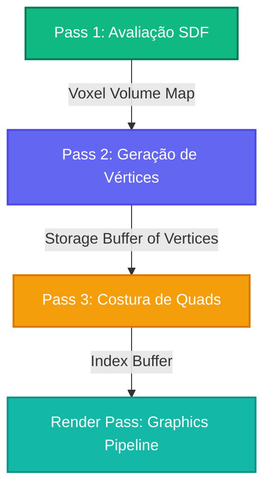

# NodeGraft: Motor Procedural 3D WebGPU

O NodeGraft (também conhecido como PolyGraft 3D) é um ambiente interativo de alto desempenho executado diretamente na GPU para geração em tempo real de ativos 3D procedurais. Utilizando **WebGPU Compute Shaders**, o NodeGraft converte representações matemáticas abstratas—especificamente **Campos de Distância com Sinal (SDFs)**—em malhas poligonais estruturadas através de um pipeline multi-pass de **Dual Contouring**.

Projetado com foco em uma infraestrutura baseada no Git de custo zero, o NodeGraft permite que designers e programadores escrevam código de shader, visualizem topologias de malha e ajustem propriedades de materiais em uma interface fluida com atualização instantânea (hot-reload).

---

## 1. Fundamentação Matemática: Campos de Distância com Sinal (SDF)

Diferente da modelagem poligonal tradicional, o NodeGraft modela geometria implicitamente usando uma Função de Distância com Sinal ($f: \mathbb{R}^3 \to \mathbb{R}$). Para qualquer ponto $\mathbf{p} \in \mathbb{R}^3$, a função avalia a distância exata até o limite mais próximo do objeto, onde o sinal do resultado indica se o ponto está dentro ou fora da superfície:

$$
f(\mathbf{p}) = \begin{cases} 
< 0 & \text{se } \mathbf{p} \text{ está dentro do limite} \\
0 & \text{se } \mathbf{p} \text{ está exatamente na superfície} \\
> 0 & \text{se } \mathbf{p} \text{ está fora do limite}
\end{cases}
$$

Como exemplo, uma esfera torcida e modulada por ruído, usada como prop procedural básico, é definida como:

$$
d_{\text{base}}(\mathbf{p}) = \|\mathbf{R}_y(\theta) \mathbf{p}\| - r
$$

$$
f(\mathbf{p}) = d_{\text{base}}(\mathbf{p}) + \sin(q_x \cdot c) \cdot \sin(q_y \cdot c) \cdot \sin(q_z \cdot c) \cdot w
$$

Onde $\mathbf{R}_y(\theta)$ é uma matriz de rotação que torce o espaço ao redor do eixo Y em função da altura, $c$ é a complexidade (frequência espacial) do ruído gyroid e $w$ representa a amplitude de deformação.

---

## 2. Pipeline de Computação Multi-Pass

Para transformar esses campos de distância matemáticos contínuos em malhas prontas para renderização, o NodeGraft executa **três etapas de computação sequenciais na GPU** (compute passes) diretamente na placa de vídeo. Esse pipeline garante que as transferências de memória entre CPU e GPU sejam reduzidas a zero, maximizando o desempenho e a estabilidade de quadros.

```
       +-------------------------------------------------+
       |             Pass 1: Avaliação SDF               |
       |  Calcula os valores de SDF na grade de voxels   |
       +-----------------------+-------------------------+
                               |
                               v
       +-------------------------------------------------+
       |          Pass 2: Geração de Vértices            |
       |  Encontra arestas ativas e posiciona vértices   |
       +-----------------------+-------------------------+
                               |
                               v
       +-------------------------------------------------+
       |            Pass 3: Costura de Quads             |
       | Costura índices de quads ao redor das arestas   |
       +-------------------------------------------------+
```



### Pass 1: Avaliação SDF
O compute shader calcula o Campo de Distância com Sinal $f(\mathbf{p})$ em uma grade de voxels discreta de tamanho $N \times N \times N$. Os valores computados são gravados diretamente em uma textura 3D float ou em uma representação de buffer de armazenamento, criando um mapa denso de distâncias no espaço 3D local.

### Pass 2: Geração de Vértices (Dual Contouring)
Diferente do algoritmo clássico de *Marching Cubes*, que posiciona os vértices diretamente sobre as arestas dos voxels, o **Dual Contouring** gera um único vértice altamente otimizado dentro de cada célula de voxel que contém uma transição de sinal (indicando que a superfície passa pela célula).

A posição do vértice $\mathbf{v}$ é calculada resolvendo uma Função de Erro Quadrático (QEF) que minimiza a distância até os planos tangentes em todos os pontos de interseção das arestas:

$$
E(\mathbf{v}) = \sum_{i} \left( \mathbf{n}_i \cdot (\mathbf{v} - \mathbf{p}_i) \right)^2
$$

Onde $\mathbf{p}_i$ representa o ponto de cruzamento da aresta (onde $f(\mathbf{p}) = 0$) e $\mathbf{n}_i$ representa o vetor normal da superfície naquele ponto, calculado através do gradiente normalizado da SDF:

$$
\mathbf{n}_i = \frac{\nabla f(\mathbf{p}_i)}{\|\nabla f(\mathbf{p}_i)\|}
$$

### Pass 3: Costura de Quads
Para cada aresta da grade que exibe uma mudança de sinal, nós localizamos as quatro células de voxel adjacentes que compartilham aquela aresta. O pipeline recupera os vértices duais gerados a partir dessas quatro células e os conecta para formar um quad (dois triângulos), enviando os dados de índices diretamente para os buffers de renderização da GPU.

---

## 3. Especificação & Enxerto Imutável

O NodeGraft implementa um sistema modular de **Enxerto de Shaders** (Shader Grafting). Em vez de compilar um único shader monolítico gigante, operações SDF individuais (como uniões, subtrações e torções) são analisadas a partir de arquivos leves de especificação `.wgsl` que contêm metadados no cabeçalho (frontmatter):

```wgsl
/**
 * @name NodeGraft Procedural Prop
 * @version 1.0.4
 * @scion RootGraft
 * @trait Size [0.3, 1.2, 0.75]
 * @trait Complexity [1.0, 10.0, 4.0]
 * @trait Twist [-5.0, 5.0, 1.5]
 * @trait Hollow [0.0, 1.0, 0.0]
 */
```

### Mecânica de Enxerto Imutável (Immutable Grafting)
- **Hash Determinístico:** Cada bloco de código `.wgsl` é hasheado criptograficamente com base em sua estrutura de origem e valores atuais de propriedades.
- **Enxerto de Nós:** Nós individuais são encadeados em um Grafo Acíclico Direcionado (DAG) imutável. Se um nó for modificado, apenas seus dependentes diretos são reavaliados, permitindo recompilações extremamente velozes e aproveitando buffers em cache.
- **Compilação Dinâmica de Propriedades:** Os comentários estruturados no frontmatter são lidos pelo parser em tempo de execução para gerar controles deslizantes (sliders) e botões de alternância na UI automaticamente, criando um elo entre variáveis de shaders WebGPU e parâmetros interativos.
