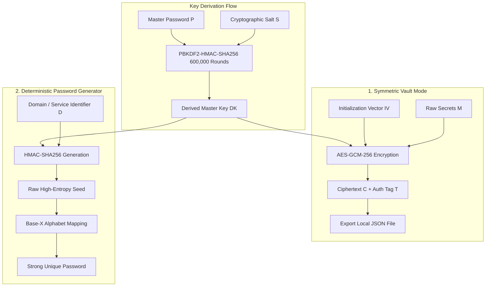

# Offline-First Deterministic Password Manager & Crypto-Vault

## Context

Modern password managers traditionally rely on cloud-hosted databases to synchronize encrypted secrets. While convenient, this model introduces massive security risks, including database exposure, central server breaches, and metadata leaks. To eliminate these trust assumptions, the **Password Manager & Crypto-Vault** is designed as an open-source, deterministic, offline-first application. It functions entirely client-side, running in-memory with zero network telemetry, allowing users to safely derive highly secure passwords or store existing secrets in a local-only encrypted vault.

## Objective

The objective of this system is to combine a **deterministic password generator** and an **authenticated Master Crypto-Vault** inside a client-side sandbox. It proves that a secure, multi-tenant digital vault can be achieved without server side databases or active cloud integrations. By utilizing modern web standards such as WebCrypto, PBKDF2-HMAC-SHA256, and AES-GCM-256, the manager implements high-entropy key derivation and authenticated encryption directly in the browser's execution stack.

---

## Technical Architecture & Design

The security model of the Password Manager separates tasks into two isolated core workflows: **Deterministic Seed-Based Derivation** (for zero-storage generation) and **Authenticated Symmetric Vaulting** (for secure offline persistence).

### Visual Cryptographic Data Flow

```text
======================================== SECURE VAULT DATA FLOW ========================================

   [ Master Password (P) ]  ---------> [ PBKDF2-HMAC-SHA256 (600,000 Rounds) ] <--------- [ Salt (S) ]
                                                       │
                                                       ▼
                                            [ Derived Master Key (DK) ]
                                                       │
                     ┌─────────────────────────────────┴─────────────────────────────────┐
                     ▼                                                                   ▼
       (1. Symmetric Vault Mode)                                           (2. Deterministic Password Gen)
                     │                                                                   │
           [ Raw Secrets (M) ]                                                          [ Domain / Context (D) ]
                     │                                                                   │
                     ▼                                                                   ▼
       [ AES-GCM-256 Encryption ] <--- [ IV ]                                     [ HMAC-SHA256 ]
                     │                                                                   │
                     ▼                                                                   ▼
       [ Ciphertext (C) + Tag (T) ]                                               [ Raw High-Entropy Seed ]
                     │                                                                   │
                     ▼                                                                   ▼
         [ Saved to local JSON File ]                                             [ Base-X Character Mapping ]
                                                                                         │
                                                                                         ▼
                                                                                   [ Strong Password ]

========================================================================================================
```



---

### 1. Key Derivation (PBKDF2-HMAC-SHA256)

To transform a human-memorable Master Password into a cryptographically strong, high-entropy symmetric key, the vault utilizes **PBKDF2** (Password-Based Key Derivation Function 2) with **SHA-256** as the underlying pseudorandom function ($\text{HMAC-SHA256}$). 

To resist massive parallel GPU/ASIC hardware brute-force attacks, the key derivation pipeline enforces an intensive workload of **600,000 iterations**. 

Mathematically, the derived key $\textcolor{#10b981}{DK}$ of length $l$ bits is derived from the Master Password $\textcolor{#3b82f6}{P_{master}}$ and a random 128-bit Salt $\textcolor{#f43f5e}{S_{salt}}$:

$$
\textcolor{#10b981}{DK} = \text{PBKDF2}(\textcolor{#3b82f6}{P_{master}}, \textcolor{#f43f5e}{S_{salt}}, \textcolor{#fbbf24}{c}, l) = U_1 \oplus U_2 \oplus \dots \oplus U_c
$$

Where the internal compression blocks $U_j$ are recursively hashed:

$$
U_1 = \text{HMAC-SHA256}_{\textcolor{#3b82f6}{P_{master}}}(\textcolor{#f43f5e}{S_{salt}} \parallel \text{INT\_32\_BE}(i))
$$
$$
U_j = \text{HMAC-SHA256}_{\textcolor{#3b82f6}{P_{master}}}(U_{j-1}) \quad \text{for } 2 \le j \le \textcolor{#fbbf24}{c}
$$

And the number of iterations $\textcolor{#fbbf24}{c}$ is set to:

$$
\textcolor{#fbbf24}{c} = 600,000
$$

This ensures that even if an attacker acquires the encrypted vault file, verifying a single password guess is computationally expensive, making brute-force search mathematically infeasible.

---

### 2. Authenticated Symmetric Encryption (AES-GCM-256)

For encrypting existing credentials, keys, or cards, the application employs **AES-256 in Galois/Counter Mode (AES-GCM)**. Unlike plain encryption modes (such as CBC), GCM is an *Authenticated Encryption with Associated Data (AEAD)* mode. It provides both semantic confidentiality and ciphertext integrity guarantees.

Every encryption process utilizes a unique, cryptographically secure, random 96-bit Initialization Vector ($\textcolor{#a855f7}{IV}$). This guarantees that encrypting the same secret twice yields entirely different ciphertexts.

The plaintext blocks $\textcolor{#fbbf24}{M_i}$ are encrypted via XOR with the AES block cipher output under the derived key $\textcolor{#10b981}{DK}$:

$$
\textcolor{#f43f5e}{C_i} = \textcolor{#fbbf24}{M_i} \oplus \text{AES}_{\textcolor{#10b981}{DK}}(\text{CTR}_i)
$$

The integrity and authenticity of the payload are verified via a 128-bit Galois Message Authentication Code ($\text{GMAC}$) tag $\textcolor{#a855f7}{T}$. This tag is calculated in the Galois Field $\text{GF}(2^{128})$ using the polynomial hash subkey $H = \text{AES}_{\textcolor{#10b981}{DK}}(0^{128})$:

$$
\textcolor{#a855f7}{T} = \text{GHASH}_H(\text{AAD}, \textcolor{#f43f5e}{C}) \oplus \text{AES}_{\textcolor{#10b981}{DK}}(\text{CTR}_0)
$$

Where the polynomial hashing function $\text{GHASH}$ is defined as:

$$
\text{GHASH}_H(X_1, \dots, X_m) = \sum_{j=1}^{m} X_j \cdot H^{m-j+1} \pmod{x^{128} + x^7 + x^2 + x + 1}
$$

During decryption, the WebCrypto API automatically validates $\textcolor{#a855f7}{T}$ against the computed polynomial product. If a single bit of the ciphertext $\textcolor{#f43f5e}{C}$ or $\textcolor{#a855f7}{IV}$ has been altered or tampered with, decryption instantly aborts, throwing a safety exception. This prevents chosen-ciphertext attacks (such as padding oracle attacks).

---

### 3. Deterministic Zero-Knowledge Paradigms

For creating site-specific credentials, the vault features a **deterministic, zero-knowledge generator**. It eliminates database leaks by rendering the database entirely obsolete. 

Instead of generating passwords randomly and saving them, the application derives unique passwords *on-demand* from two elements:
1. The derived master key $\textcolor{#10b981}{DK}$ (possessive factor).
2. The domain or service name $\textcolor{#fbbf24}{D}$ (contextual factor).

Because the derivation uses a cryptographic Hash-based Message Authentication Code ($\text{HMAC}$), it is mathematically impossible to reverse-engineer the Master Password or link passwords between different domains.

The intermediate high-entropy raw seed $\textcolor{#a855f7}{V_{seed}}$ is generated via:

$$
\textcolor{#a855f7}{V_{seed}} = \text{HMAC-SHA256}_{\textcolor{#10b981}{DK}}(\textcolor{#fbbf24}{D})
$$

To produce a human-usable string, the seed is mapped into a strict character alphabet $\Sigma$ of length $|\Sigma|$ containing uppercase, lowercase, numbers, and symbols:

$$
\textcolor{#10b981}{G_{pass}}[j] = \Sigma[\textcolor{#a855f7}{V_{seed}}[j] \pmod{|\Sigma|}]
$$

This ensures:
* **Zero Database footprint**: No secrets are ever stored in a database or local cache.
* **Deterministic consistency**: Entering the same master password and domain always yields the exact same strong password.
* **Domain Isolation**: Even if an attacker learns the password for domain $D_1$, they gain absolutely zero information about the password for domain $D_2$.

---

### 4. Offline-First Resilience & Sandbox Execution

The system operates strictly within the boundaries of the client-side sandbox:

* **Zero-Telemetry**: No network calls, telemetry scripts, or external API endpoints are configured. All WebCrypto invocations execute inside the browser's native engine.
* **In-Memory Volatility**: Master passwords and derived keys reside only inside transient Javascript memory space and are immediately garbage-collected upon browser tab close.
* **Direct JSON Export/Import**: Users retain complete sovereignty over their encrypted vaults. Persistence is handled via file system streams—allowing users to export their encrypted vaults as `.json` text files and import them on other sandboxed instances without third-party middle-men.
