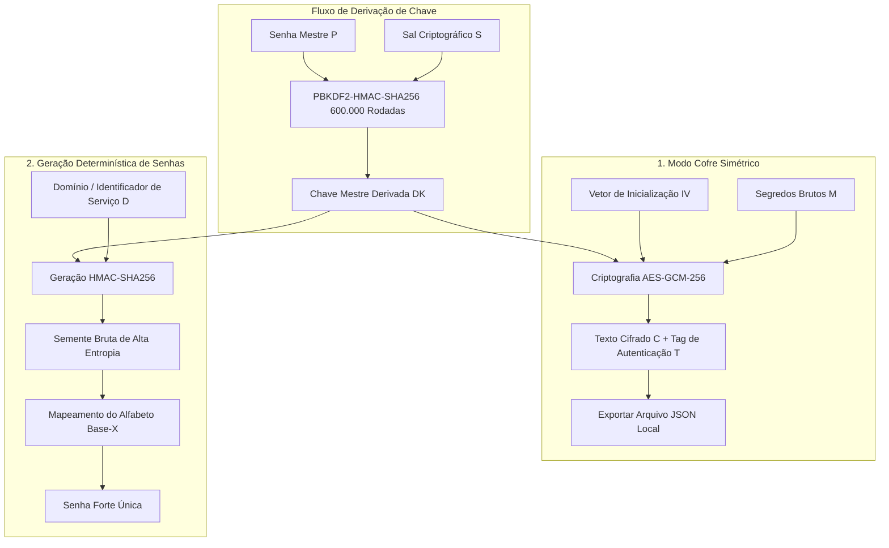

# Gerenciador de Senhas Determinístico & Crypto-Vault Offline-First

## Contexto

Os gerenciadores de senhas modernos tradicionalmente dependem de bancos de dados hospedados na nuvem para sincronizar segredos criptografados. Embora conveniente, este modelo introduz riscos de segurança massivos, incluindo exposição do banco de dados, violações do servidor central e vazamentos de metadados. Para eliminar essas premissas de confiança, o **Password Manager & Crypto-Vault** foi projetado como uma aplicação de código aberto, determinística e offline-first. Ele funciona inteiramente no lado do cliente (client-side), rodando em memória com zero telemetria de rede, permitindo aos usuários derivar senhas altamente seguras com segurança ou armazenar segredos existentes em um cofre criptografado estritamente local.

## Objetivo

O objetivo deste sistema é combinar um **gerador de senhas determinístico** e um **Crypto-Vault Master autenticado** dentro de uma sandbox no lado do cliente. Isso prova que um cofre digital seguro e multi-inquilino pode ser alcançado sem bancos de dados no servidor ou integrações ativas na nuvem. Ao utilizar padrões web modernos como WebCrypto, PBKDF2-HMAC-SHA256 e AES-GCM-256, o gerenciador implementa derivação de chave de alta entropia e criptografia autenticada diretamente na pilha de execução do navegador.

---

## Arquitetura Técnica & Design

O modelo de segurança do Password Manager separa as tarefas em dois fluxos de trabalho principais isolados: **Derivação Determinística Baseada em Semente** (para geração sem armazenamento) e **Cofre Simétrico Autenticado** (para persistência offline segura).

### Fluxo de Dados Criptográficos Visual

```text
======================================= FLUXO DE DADOS DO COFRE SEGURO =======================================

   [ Senha Mestre (P) ]  ---------> [ PBKDF2-HMAC-SHA256 (600.000 Rodadas) ] <--------- [ Sal (S) ]
                                                       │
                                                       ▼
                                           [ Chave Mestre Derivada (DK) ]
                                                       │
                     ┌─────────────────────────────────┴─────────────────────────────────┐
                     ▼                                                                   ▼
         (1. Modo Cofre Simétrico)                                           (2. Geração Determinística)
                     │                                                                   │
           [ Segredos Brutos (M) ]                                              [ Domínio / Contexto (D) ]
                     │                                                                   │
                     ▼                                                                   ▼
       [ Criptografia AES-GCM-256 ] <--- [ IV ]                                   [ HMAC-SHA256 ]
                     │                                                                   │
                     ▼                                                                   ▼
       [ Texto Cifrado (C) + Tag (T) ]                                            [ Semente de Alta Entropia ]
                     │                                                                   │
                     ▼                                                                   ▼
         [ Salvo em Arquivo JSON Local ]                                          [ Mapeamento de Caracteres ]
                                                                                         │
                                                                                         ▼
                                                                                   [ Senha Forte ]

==============================================================================================================
```



---

### 1. Derivação de Chave (PBKDF2-HMAC-SHA256)

Para transformar uma Senha Mestre memorizável por humanos em uma chave simétrica criptograficamente forte e de alta entropia, o cofre utiliza **PBKDF2** (Password-Based Key Derivation Function 2) com **SHA-256** como a função pseudialeatória subjacente ($\text{HMAC-SHA256}$).

Para resistir a ataques massivos de força bruta em hardware paralelo de GPU/ASIC, o pipeline de derivação de chave impõe uma carga de trabalho intensiva de **600.000 iterações**.

Matematicamente, a chave derivada $\textcolor{#10b981}{DK}$ de comprimento $l$ bits é derivada da Senha Mestre $\textcolor{#3b82f6}{P_{master}}$ e de um Sal aleatório de 128 bits $\textcolor{#f43f5e}{S_{salt}}$:

$$
\textcolor{#10b981}{DK} = \text{PBKDF2}(\textcolor{#3b82f6}{P_{master}}, \textcolor{#f43f5e}{S_{salt}}, \textcolor{#fbbf24}{c}, l) = U_1 \oplus U_2 \oplus \dots \oplus U_c
$$

Onde os blocos de compressão interna $U_j$ são hashados recursivamente:

$$
U_1 = \text{HMAC-SHA256}_{\textcolor{#3b82f6}{P_{master}}}(\textcolor{#f43f5e}{S_{salt}} \parallel \text{INT\_32\_BE}(i))
$$
$$
U_j = \text{HMAC-SHA256}_{\textcolor{#3b82f6}{P_{master}}}(U_{j-1}) \quad \text{for } 2 \le j \le \textcolor{#fbbf24}{c}
$$

E o número de iterações $\textcolor{#fbbf24}{c}$ está configurado como:

$$
\textcolor{#fbbf24}{c} = 600.000
$$

Isso garante que, mesmo se um invasor adquirir o arquivo criptografado do cofre, a verificação de um único palpite de senha seja computacionalmente muito cara, tornando a busca por força bruta matematicamente inviável.

---

### 2. Criptografia Simétrica Autenticada (AES-GCM-256)

Para criptografar credenciais, chaves ou cartões existentes, a aplicação emprega **AES-256 em Galois/Counter Mode (AES-GCM)**. Ao contrário de modos de criptografia simples (como o CBC), o GCM é um modo de *Criptografia Autenticada com Dados Associados (AEAD)*. Ele fornece garantias de confidencialidade semântica e integridade do texto cifrado.

Cada processo de criptografia utiliza um Vetor de Inicialização único, criptograficamente seguro e aleatório de 96 bits ($\textcolor{#a855f7}{IV}$). Isso garante que a criptografia do mesmo segredo duas vezes gere textos cifrados totalmente diferentes.

Os blocos de texto simples $\textcolor{#fbbf24}{M_i}$ são criptografados via operação XOR com a saída da cifra de bloco AES sob a chave derivada $\textcolor{#10b981}{DK}$:

$$
\textcolor{#f43f5e}{C_i} = \textcolor{#fbbf24}{M_i} \oplus \text{AES}_{\textcolor{#10b981}{DK}}(\text{CTR}_i)
$$

A integridade e a autenticidade da carga útil são verificadas através de uma tag de Código de Autenticação de Mensagem Galois ($\text{GMAC}$) de 128 bits $\textcolor{#a855f7}{T}$. Esta tag é calculada no Campo de Galois $\text{GF}(2^{128})$ usando a subchave de hash polinomial $H = \text{AES}_{\textcolor{#10b981}{DK}}(0^{128})$:

$$
\textcolor{#a855f7}{T} = \text{GHASH}_H(\text{AAD}, \textcolor{#f43f5e}{C}) \oplus \text{AES}_{\textcolor{#10b981}{DK}}(\text{CTR}_0)
$$

Onde a função de hash polinomial $\text{GHASH}$ é definida como:

$$
\text{GHASH}_H(X_1, \dots, X_m) = \sum_{j=1}^{m} X_j \cdot H^{m-j+1} \pmod{x^{128} + x^7 + x^2 + x + 1}
$$

Durante a descriptografia, a API WebCrypto valida automaticamente $\textcolor{#a855f7}{T}$ contra o produto polinomial calculado. Se um único bit do texto cifrado $\textcolor{#f43f5e}{C}$ ou do $\textcolor{#a855f7}{IV}$ for alterado ou adulterado, a descriptografia é interrompida instantaneamente, lançando uma exceção de segurança. Isso evita ataques de texto cifrado escolhido (como ataques de oráculo de preenchimento).

---

### 3. Paradigmas Determinísticos de Conhecimento Zero

Para criar credenciais específicas do site, o cofre apresenta um **gerador determinístico de conhecimento zero**. Ele elimina os vazamentos de banco de dados, tornando o banco de dados inteiramente obsoleto.

Em vez de gerar senhas aleatoriamente e salvá-las, o aplicativo deriva senhas exclusivas *sob demanda* a partir de dois elementos:
1. A chave mestre derivada $\textcolor{#10b981}{DK}$ (fator de posse).
2. O domínio ou nome do serviço $\textcolor{#fbbf24}{D}$ (fator de contexto).

Como a derivação usa um Código de Autenticação de Mensagem baseado em Hash criptográfico ($\text{HMAC}$), é matematicamente impossível fazer engenharia reversa da Senha Mestre ou vincular senhas entre domínios diferentes.

A semente bruta intermediária de alta entropia $\textcolor{#a855f7}{V_{seed}}$ é gerada via:

$$
\textcolor{#a855f7}{V_{seed}} = \text{HMAC-SHA256}_{\textcolor{#10b981}{DK}}(\textcolor{#fbbf24}{D})
$$

Para produzir uma string legível e utilizável por humanos, a semente é mapeada em um alfabeto de caracteres estrito $\Sigma$ de comprimento $|\Sigma|$ contendo letras maiúsculas, minúsculas, números e símbolos:

$$
\textcolor{#10b981}{G_{pass}}[j] = \Sigma[\textcolor{#a855f7}{V_{seed}}[j] \pmod{|\Sigma|}]
$$

Isso garante:
* **Zero Pegada de Banco de Dados**: Nenhum segredo é armazenado em banco de dados ou cache local.
* **Consistência Determinística**: Inserir a mesma senha mestre e domínio sempre resulta na exata mesma senha forte.
* **Isolamento de Domínio**: Mesmo se um invasor descobrir a senha do domínio $D_1$, ele ganha absolutamente nenhuma informação sobre a senha do domínio $D_2$.

---

### 4. Resiliência Offline-First & Execução em Sandbox

O sistema opera estritamente dentro dos limites da sandbox do lado do cliente:

* **Zero Telemetria**: Sem chamadas de rede, scripts de telemetria ou endpoints de API externos configurados. Todas as invocações WebCrypto são executadas no motor nativo do navegador.
* **Volatilidade em Memória**: As senhas mestre e as chaves derivadas residem apenas no espaço de memória JavaScript transitório e são imediatamente limpas pelo coletor de lixo ao fechar a guia do navegador.
* **Exportação/Importação JSON Direta**: Os usuários mantêm total soberania sobre seus cofres criptografados. A persistência é gerenciada através de fluxos do sistema de arquivos—permitindo que os usuários exportem seus cofres como arquivos de texto `.json` e os importem em outras instâncias sandboxed sem intermediários ou terceiros.
